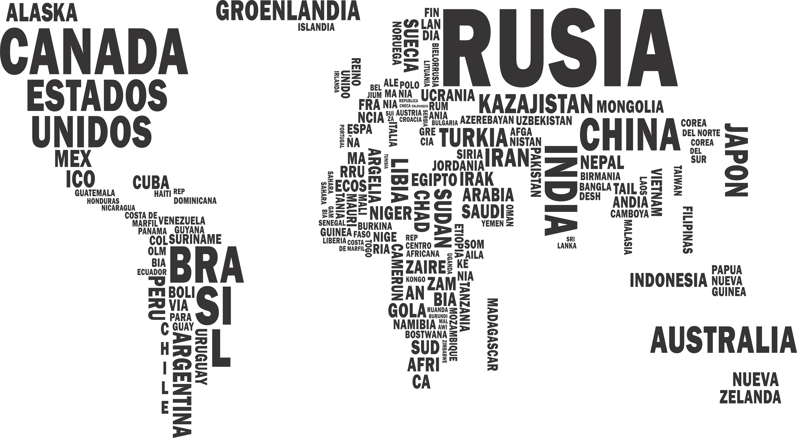

# **COUNTRIES** | Proyecto Individual

## **📌 OBJETIVOS**

-  Construir una Single Page Application utlizando las tecnologías: **React**, **Redux**, **Node**, **Express** y **Sequelize**.
-  Poner en práctica recursos básicos de estilos y diseño (UX : UI).
-  Afirmar y conectar los conceptos aprendidos en la carrera.
-  Aprender mejores prácticas.
-  Aprender y practicar el workflow de GIT.
-  Utilizar y practicar testing.

<br />

---

## **⏱ HORARIOS Y FECHAS**

El proyecto individual tiene una duración máxima de tres semanas. Se inicia la primera semana con un Kick-Off, y se agendará una corrección personalizada la última semana.

En el caso de completar todas las tareas antes de dicho lapso se podrá avisar a su instructor para coordinar una fecha de presentación del trabajo (DEMO).

<br />

---

## **⚠️ IMPORTANTE**

Es necesario contar minimamente con la última versión estable de NodeJS y NPM. Asegúrate de contar con ella para poder instalar correctamente las dependecias necesarias para correr el proyecto. Actualmente las versiónes necesarias son:

-  **Node**: 12.18.3 o mayor
-  **NPM**: 6.14.16 o mayor

Para verificar que versión tienes instalada:

```bash
node -v
npm -v
```


Está permitido, **bajo tu responsabilidad**, actualizar las dependencias a versiones más actuales si lo deseas. Versiones mas actuales podrían presentar configuraciones diferentes respecto a las versiones en las que venimos trabajando durante el bootcamp.

### **⛔️ Está rotundamente prohibido utilizar librerías externas para aplicar estilos a la SPA. Tendrás que utilizar CSS mediante algunas de las opciones vistas en el bootcamp (CSS, Legacy, Inline Styling, CSS Modules o Styled Components).**

<br />

---
## **📋 SOBRE LA API**

En este proyecto la API de Countries **correrá localmente desde tu computadora**. De esta manera, siempre tendrás disponible los datos de forma local para poder realizar tu proyecto.

Para lograr que esta API funcione desde tu computadora deberás dirigirte, desde tu terminal, a la carpeta **`server`** y ejecutar el comando:

```bash
   npm start
```

Podrás ver el siguiente mensaje en tu terminal.

``` 
[0] 
[0] > server@1.0.0 server
[0] > nodemon index.js
[0] 
[1] 
[1] > server@1.0.0 api
[1] > echo 'Local API listening on PORT 5000' & json-server --watch api/db.json -p 5000 -q
[1] 
[1] 'Local API listening on PORT 5000' 
[0] [nodemon] 2.0.22
[0] [nodemon] to restart at any time, enter `rs`
[0] [nodemon] watching path(s): *.*
[0] [nodemon] watching extensions: js,mjs,json
[0] [nodemon] starting `node index.js`
[0] Server listening on port 3001

```

Esto significa que la API ya está corriendo en tu computadora en el puerto 5000. Es decir que podrás acceder a ella desde la URL **`http://localhost:5000`**. Para poder comunicarte con esta API deberás dejar la terminal levantada.

**IMPORTANTE**
No debes modificar **NINGÚN** archivo dentro de la carpeta **`/server/api`**. Cualquier modificación en estos archivos puede alterar el funcionamiento normal de la API y de tu proyecto.

<br />

---


## **📋 PARA COMENZAR...**

1. Deberás forkear este repositorio para tener una copia del mismo en tu cuenta personal de GitHub.

2. Clona el repositorio en tu computadora para comenzar a trabajar. Este repositorio contiene un **`BoilerPlate`** con la estructura general del proyecto, tanto del servidor como del cliente. El boilerplate cuenta con dos carpetas: **`api`** y **`client`**. En estas carpetas estará el código del back-end y el front-end respectivamente.

3. En la carpeta **`server`** deberás crear un archivo llamado: **`.env`** que tenga la siguiente forma:

   ```env
       DB_USER=usuariodepostgres
       DB_PASSWORD=passwordDePostgres
       DB_HOST=localhost
   ```

4. Reemplazar **`usuariodepostgres`** y **`passwordDePostgres`** con tus propias credenciales para conectarte a postgres. Este archivo va ser ignorado en la subida a github, ya que contiene información sensible (las credenciales).

5. Adicionalmente será necesario que crees, **desde psql (shell o PGAdmin)**, una base de datos llamada **`countries`**. Si no realizas este paso de manera manual no podrás avanzar con el proyecto.

<br />

---

## **📖 ENUNCIADO GENERAL**

La idea de este proyecto es construir una aplicación web a partir de la API [**countries**] en la que se pueda:

-  Buscar países.
-  Visualizar la información de los países.
-  Filtrarlos.
-  Ordenarlos.
-  Crear actividades turísticas.

⚠️ Para las funcionalidades de filtrado y ordenamiento NO se puede utilizar los endpoints de la API externa que ya devuelven los resultados filtrados u ordenados.

### **Único end-point que se puede utilizar**

-  [**http://localhost:5000/countries**]

<br />

---

<div align="center">

## **📁 INSTRUCCIONES**

</div>

<br />

### **🖱 BASE DE DATOS**

Deberás crear dos modelos para tu base de datos. Una será para los países y la otra será para las actividades turísticas (pueden llevar el nombre que tu quieras). La relación entre ambos modelos debe ser de muchos a muchos. A continuación te dejamos las propiedades que debe tener cada modelo. Aquellas marcadas con un asterísco son obligatorias.

**📍 MODELO 1 | Country**

-  ID (Código de tres letras). \*
-  Nombre. \*
-  Imagen de la bandera. \*
-  Continente. \*
-  Capital. \*
-  Subregión.
-  Área.
-  Población. \*

<br />

**📍 MODELO 2 | Activity**

-  ID. \*
-  Nombre. \*
-  Dificultad (número del 1 al 5). \*
-  Duración (en horas).
-  Temporada (Verano, Otoño, Invierno o Primavera). \*

<br />

---

<br />

### **🖱 BACK-END**

Para esta parte deberás construir un servidor utilizando **NodeJS** y **Express**. Tendrás que conectarlo con tu base de datos mediante **Sequelize**.

En una primera instancia, al levantar tu servidor se deberá hacer una petición a la API, y se tendrán que guardar todos los países dentro de tu base de datos. Una vez guardados, toda tu aplicación utilizará la información sólo de tu base de datos.

Tu servidor deberá contar con las siguientes rutas:

#### **📍 GET | /countries**

-  Obtiene un arreglo de objetos, donde cada objeto es un país con toda su información.

#### **📍 GET | /countries/:idPais**

-  Esta ruta obtiene el detalle de un país específico. Es decir que devuelve un objeto con la información pedida en el detalle de un país.
-  El país es recibido por parámetro (ID de tres letras del país).
-  Tiene que incluir los datos de las actividades turísticas asociadas a este país.

#### **📍 GET | /countries/name?="..."**

-  Esta ruta debe obtener todos aquellos países que coinciden con el nombre recibido por query. (No es necesario que sea una coincidencia exacta).
-  Debe poder buscarlo independientemente de mayúsculas o minúsculas.
-  Si no existe el país, debe mostrar un mensaje adecuado.

#### **📍 POST | /activities**

-  Esta ruta recibirá todos los datos necesarios para crear una actividad turística y relacionarla con los países solicitados.
-  Toda la información debe ser recibida por body.
-  Debe crear la actividad turística en la base de datos, y esta debe estar relacionada con los países indicados (al menos uno).

#### **📍 GET | /activities**

-  Obtiene un arreglo de objetos, donde cada objeto es una actividad turística.

<br />

---

<br />

### **🖱 FRONT-END**

Se debe desarrollar una aplicación utilizando **React** y **Redux** que contenga las siguientes vistas:

**📍 LANDING PAGE |** deberás crear una página de inicio o bienvenida con:

-  Alguna imagen de fondo representativa al proyecto.
-  Botón para ingresar a la **`home page`**.

<br />

**📍 HOME PAGE |** la página principal de tu SPA debe contener:

-  SearchBar: un input de búsqueda para encontrar países por nombre.
-  Sector en el que se vea un listado de cards con los países. Al iniciar deberá cargar los primeros resultados obtenidos desde la ruta **`GET /countries`** y deberá mostrar su:
   -  Imagen de la bandera.
   -  Nombre.
   -  Continente.
-  Cuando se le hace click a una Card deberá redirigir al detalle de ese país específico.
-  Botones/Opciones para **filtrar** por continente y por tipo de actividad turística.
-  Botones/Opciones para **ordenar** tanto ascendentemente como descendentemente los países por orden alfabético y por cantidad de población.
-  Paginado: el listado de países se hará por partes. Tu SPA debe contar con un paginado que muestre un total de 10 países por página.

<br />

**📍 DETAIL PAGE |** en esta vista se deberá mostrar toda la información específica de un país:

-  ID (Código de tres letras).
-  Nombre.
-  Imagen de la bandera.
-  Continente.
-  Capital.
-  Subregión (si tiene).
-  Área (si tiene).
-  Población.

<br />

**📍 FORM PAGE |**: en esta vista se encontrará el formulario para crear una actividad turística.

Este formulario debe ser **controlado completamente con JavaScritp**. No se pueden utilizar validaciones HTML, ni utilizar librerías especiales para esto. Debe contar con los siguientes campos:

-  Nombre.
-  Dificultad.
-  Duración.
-  Temporada.
-  Posibilidad de seleccionar/agregar varios países en simultáneo.
-  Botón para crear la actividad turística.

> [**IMPORANTE**]: es requisito que el formulario de creación esté validado sólo con JavaScript. Puedes agregar las validaciones que consideres. Por ejemplo: que el nombre de la actividad no pueda contener números, o que la duración no pueda exceder determinado valor, etc.

<br />

---

<br />

### **🖱 TESTING**

Ten en cuenta que en esta instancia no es obligatorio el desarrollo de testing para tu aplicación. De igual manera, te desafiamos a que los hagas, ¡ya que suman puntos!

-  Al menos tener un componente del frontend con sus tests respectivos.
-  Al menos tener dos rutas del backend con sus tests respectivos.
-  Al menos tener un modelo de la base de datos con sus tests respectivos.

<br />

---

<br />

  
